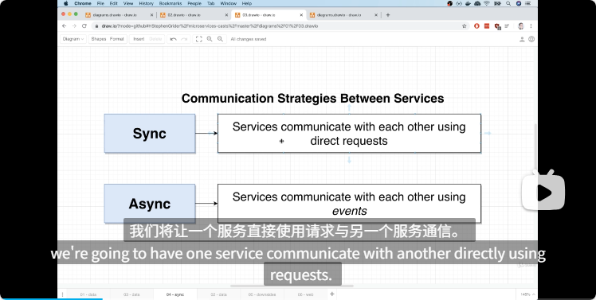

### 1.服务间数据管理
- 每个服务有自己独立的数据库，如何管理？
## 服务间通信的同步与异步

# 两种方案
1.event bus获取所有服务的事件，然后进行处理实现异步通信（比较原始）
2.服务注册到event bus实现服务自治
### k8s
## 创建一个容器
bash 
  - docker build -t stephengrider/posts:0.0.1 .
  - kubectl apply -f posts.yaml
  - kubectl get pods
## 操作容器
  - kubectl delete pod posts-6587846864-84686
  - kubectl rollout restart deployment posts-depl
  - kubectl describe deployment posts-depl
  - kubectl logs posts-6587846864-84686
### sakffold
## 启动命令
bash
  - skaffold dev

### 第二个应用在blog之上的改进
1、服务间的重复依赖
  - 教程用的npm，我认为pnpm的monorepo的开发模式更适合微服务架构
2、服务间的通信流向
3、使用ts开发
4、测试
5、上云
## 总体架构
